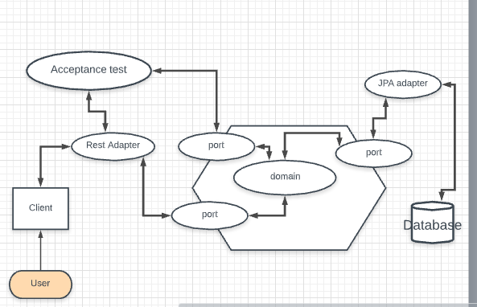

# Bookmark and short url
[](https://app.codacy.com/manual/Avinash1604/bookmarks?utm_source=github.com&utm_medium=referral&utm_content=Avinash1604/bookmarks&utm_campaign=Badge_Grade_Dashboard)
[](https://travis-ci.com/Avinash1604/bookmarks) [](https://coveralls.io/github/Avinash1604/bookmarks?branch=master)
## About
A URL shortener is a service that is used to create short links from very long URL this will solve long url issue and Bookmark is to store the all the urls related to application and can be categorize as different group and share the group related urls


## CI/CD 
 
Code deployment process is automated , used Travis CI to build and deploy when code is pushed to master , 

Angular build :
Below are the task taken care by Travis :
* Clone project 
* Check for lint issue 
* Test case 
* Coverage 
 coveralls plugin used for the automate coverage for UI , coveralls dashboard will show details of overall coverage
* Auto deployment to git hub pages 

Spring boot Kotlin : 
* Travis CI will run the test cases and make sure that get the coverage 
* Integrated with heroku and will be deployed automatically when code is merged to master.

## Demo 
Swagger
* `https://bookmarks-tiny.herokuapp.com/swagger-ui.html` [url](https://bookmarks-tiny.herokuapp.com/swagger-ui.html)

Application 
* `https://avinash1604.github.io/bookmarks/`[demo](https://avinash1604.github.io/bookmarks/)

Database schema  
* `https://github.com/Avinash1604/bookmarks/tree/master/bootstrap/src/main/resources`[location](https://github.com/Avinash1604/bookmarks/tree/master/bootstrap/src/main/resources)

### How to set up application on local
#### Backend - requirement - kotlin
 - [OPENJDK 11](https://jdk.java.net/11/)
 - [Maven 3](https://maven.apache.org)
 - Intellij or STS IDE 
 
 There are several ways to run a Spring Boot application on your local machine. One way is to execute the `main` method in the `com.bookmark.BookmarkApplication` class from your IDE.
 
 Alternatively you can use the [Spring Boot Maven plugin](https://docs.spring.io/spring-boot/docs/current/reference/html/build-tool-plugins-maven-plugin.html) like so:
 
 ```shell
 mvn spring-boot:run
 ```
 Once after ran successfully then validate all apis on swagger 
 ```swagger
http://localhost:8080/swagger-ui/index.html or http://localhost:8080/swagger-ui.html
```
#### Front end - angular
 - [README](https://github.com/Avinash1604/bookmarks/blob/master/bookmark-ui/README.md)
### Technology and versions 
```
* Backend

	 * Language: kotlin (OpenJDK 11.2)
	 * Framework: Spring, spring-boot, spring-jpa
         * documentation: Swagger 3.0.2
         * database : postgres 
         * code quality: codacy, maven enforcer 
         * code coverage: Jacoco, coveralls
         * Test Framework: Junit 5 

*Front end 

         * Language: Angular (version 9)
         * code quality: codacy, Lint  
         * code coverage: coveralls
         * Test Framework: jasmine
  
```
## Overall Architecture
The application is build upon a very strong hexagonal architecture where every piece of code is tested through BDD and TDD.



### HOW to use An Application 
 Go to below url
* `https://avinash1604.github.io/bookmarks/`[demo](https://avinash1604.github.io/bookmarks/)

###### Home page 
you can see a home page where you can create a short url and which will expire after a standard default timespan. 

Below logic is applied for the short url creation  

 - Store the url information on database and get the primary key 
 - convert primary key to base 62 , basically storing the remainder - which is the short code for the long url
    
    ex: 1000%62 = 8, 16 --- results 
    
    then encrypt the key using 64 bit private key and decrypt(reverse process) to get the primary key of the table to get long url
    
 - Below are the format of the short url 
 ```
 https://bookmarks-tiny.herokuapp.com/v1/cl 
 
    - host("https://bookmarks-tiny.herokuapp.com")
    - uri("/v1/") this added because avoid swagger ulr to treat as redirect url
    - short url code(cl)
  ```
    
###### dashboard page 
 From home screen you can directly to go to dashboard to access bookmarked cards by click on [dashboard](https://avinash1604.github.io/bookmarks/dashboard/all-links) button or register/login to go to dashboard
  
  Below are the task can do on dashboard - on menu option
   
   -  list of bookmarked card - operation - add , delete , copy , copy to group
   -  left border style indicator whether card is expired(red) and active(green)
   -  group - Action - add , delete , update , copy group url 
   -  left border style indicator whether have access to group (green) or  not (red)
   -  group related activity requires user login 
   -  Admin/users can go to inside group and manage bookmarked url , add , upload , download files , manage users 

  

 
    
    